# 📚 GyanaHub – Offline Knowledge Capsule

An offline-first web application that provides structured learning content across multiple domains like Career, General Knowledge, Health, and Science — accessible anytime, even without internet.

---

## 🌟 Project Overview

GyanaHub is built using React and TypeScript to deliver categorized knowledge in a simple and user-friendly way.  
The application is designed to work even in low or no internet conditions using Service Workers.

---

## 🎯 Problem Statement

Many learners do not have consistent internet access, which limits their ability to explore educational resources.

This project solves that by:
- Providing offline access to learning content  
- Organizing information into simple categories  
- Delivering a fast and lightweight user experience  

---

## ⚙️ Key Features

- 📂 Category-based learning (Career, GK, Health, Science, etc.)
- 📄 Article-based structured content
- 🧠 Quiz module (extendable)
- 🌐 Offline support using Service Workers
- ⚡ Fast performance with Vite
- 🎨 Clean and responsive UI

---

## 🛠️ Tech Stack

**Frontend:** React.js (TypeScript), Vite, Tailwind CSS  
**Libraries:** React Router DOM, Lucide React  
**Concepts:** Service Workers, PWA fundamentals, React Hooks  

---

## 🧠 Offline Functionality

This project uses **Service Workers**:

- Caches important files (HTML, CSS, JS)
- Stores content locally after first load
- Allows app to run without internet

👉 This makes the application **offline-first**

---

## 📂 Project Structure

    src/
    ├── components/
    ├── pages/
    │   ├── Index.tsx
    │   ├── Capsules.tsx
    │   ├── CapsuleCategory.tsx
    │   ├── Article.tsx
    │   ├── About.tsx
    │   ├── Contact.tsx
    ├── App.tsx
    └── main.tsx

---

## 🔁 Routing Flow

- `/` → Home Page  
- `/capsules` → Categories  
- `/capsule/:categoryId` → Category Page  
- `/capsule/:categoryId/article/:articleId` → Article Page  

---

## 📸 Demo Screenshots

### Home Page
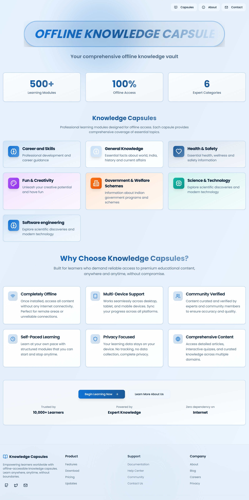

###  Capsules Page
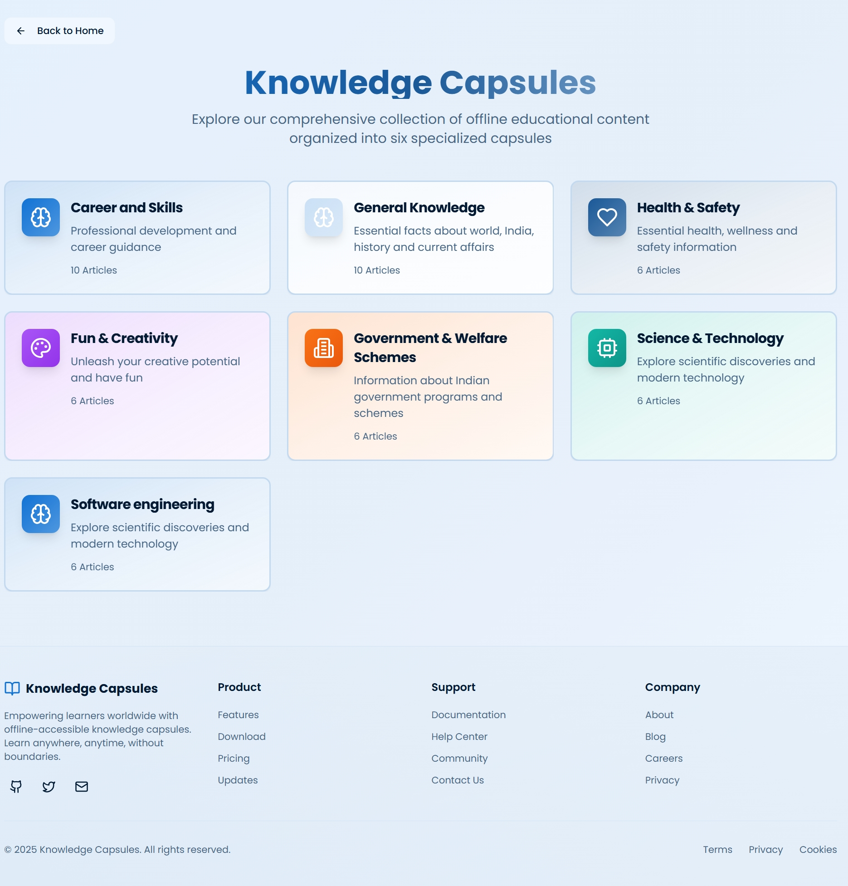

###  About Page
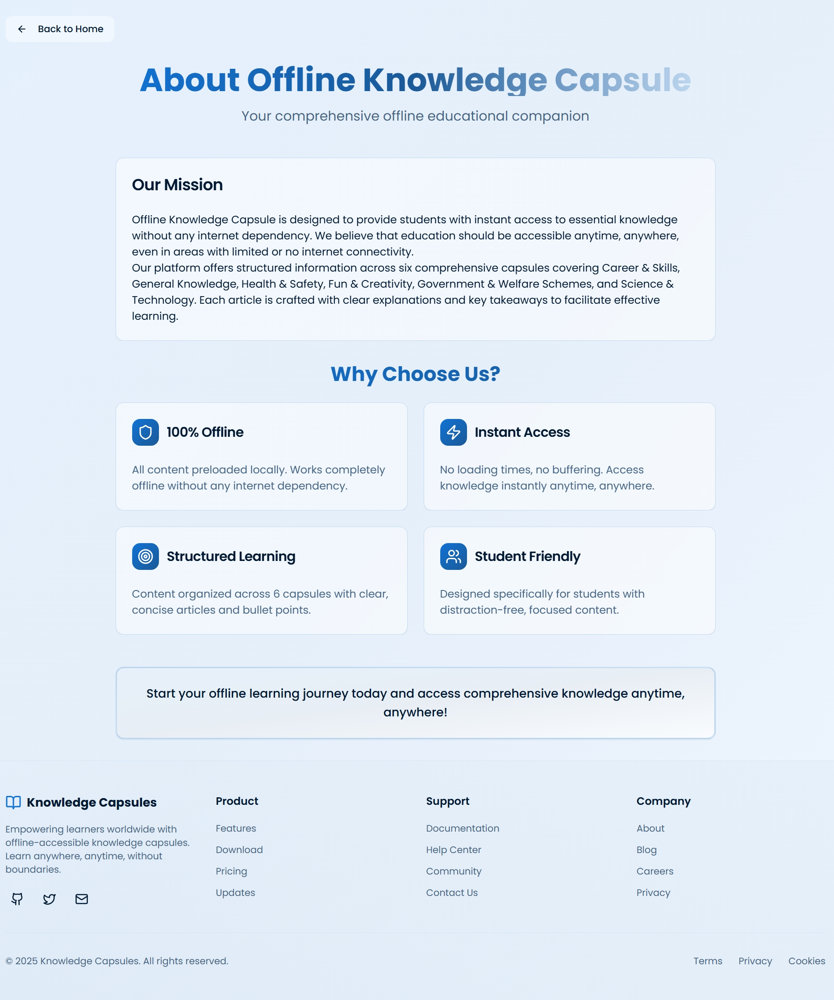

###  Career and Skill Page
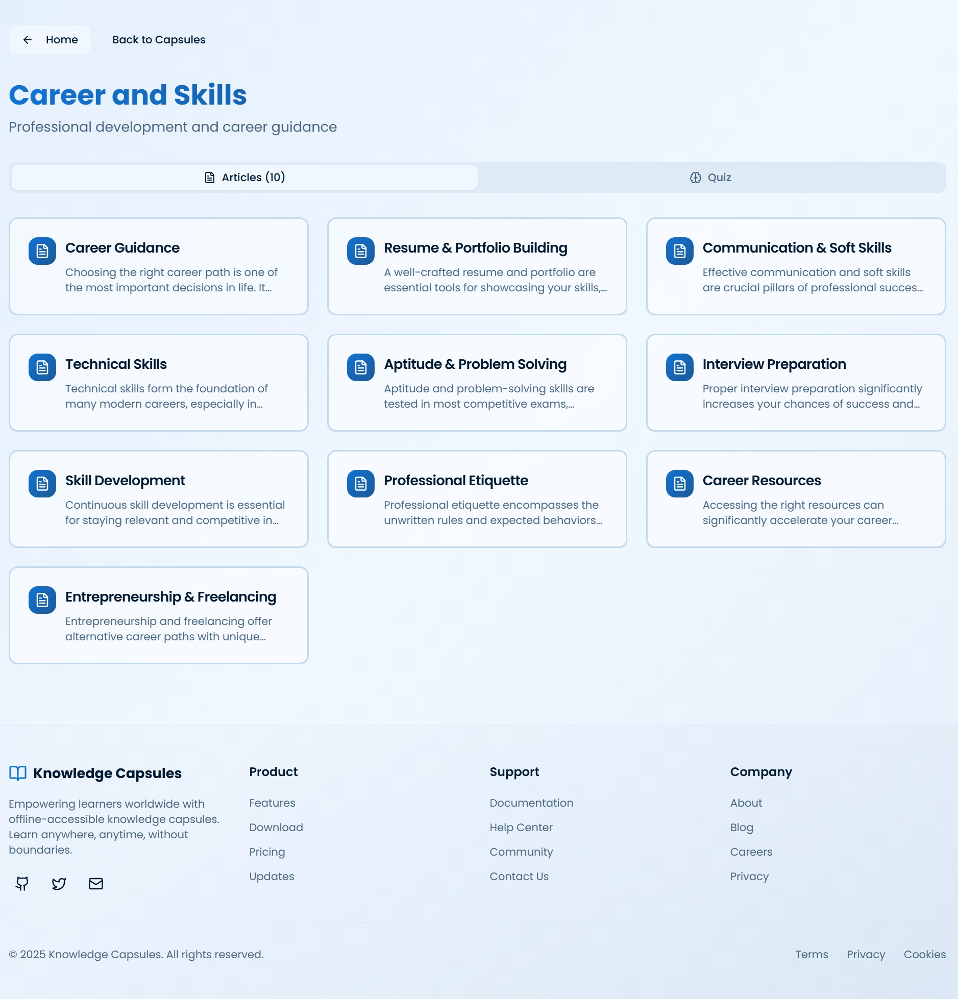

###   Example of Article in Career and Skill Page
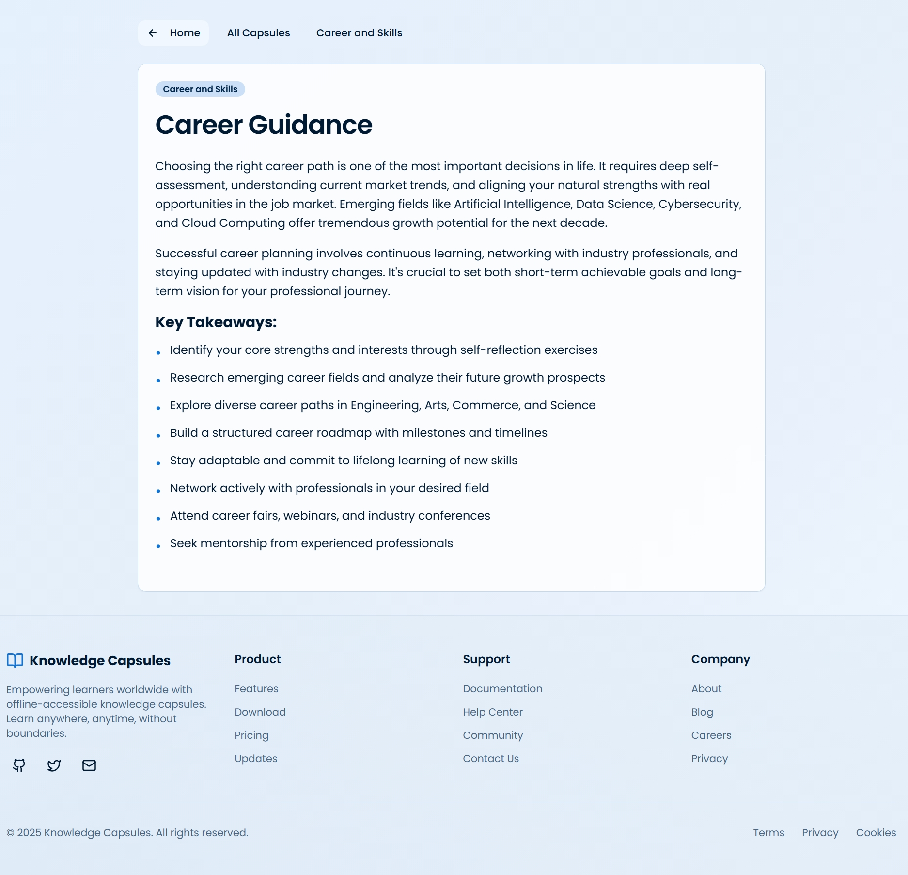

###  General Knowledge Page
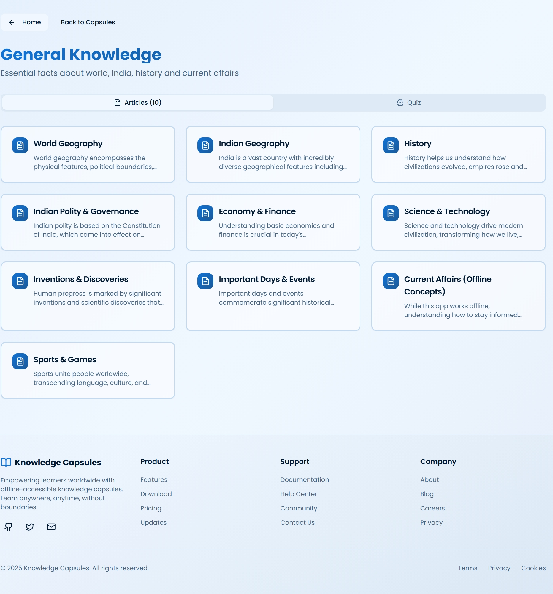

###   Example of Article in General Knowledge Page
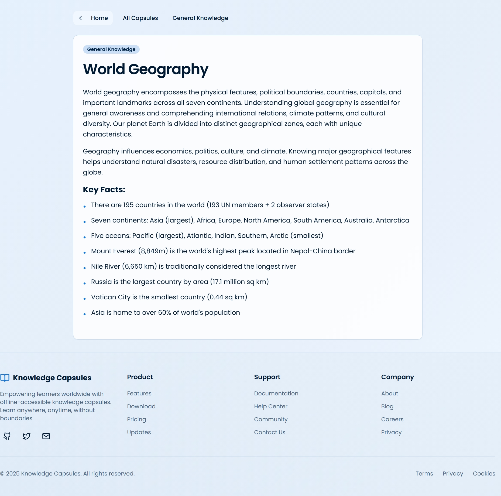

###  Health care and Awarness Page
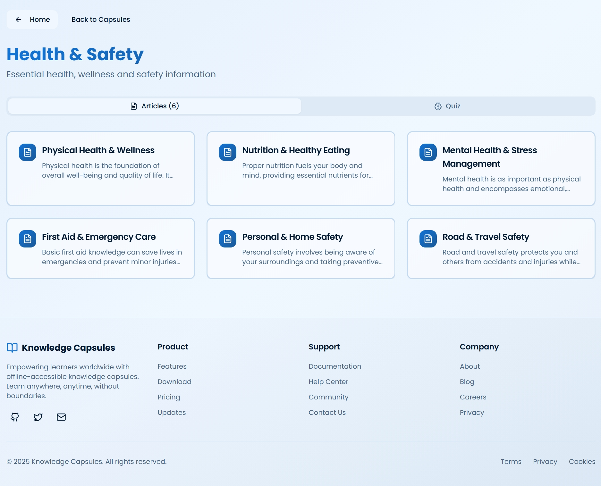

###   Example of Article in Health care and Awareness Page
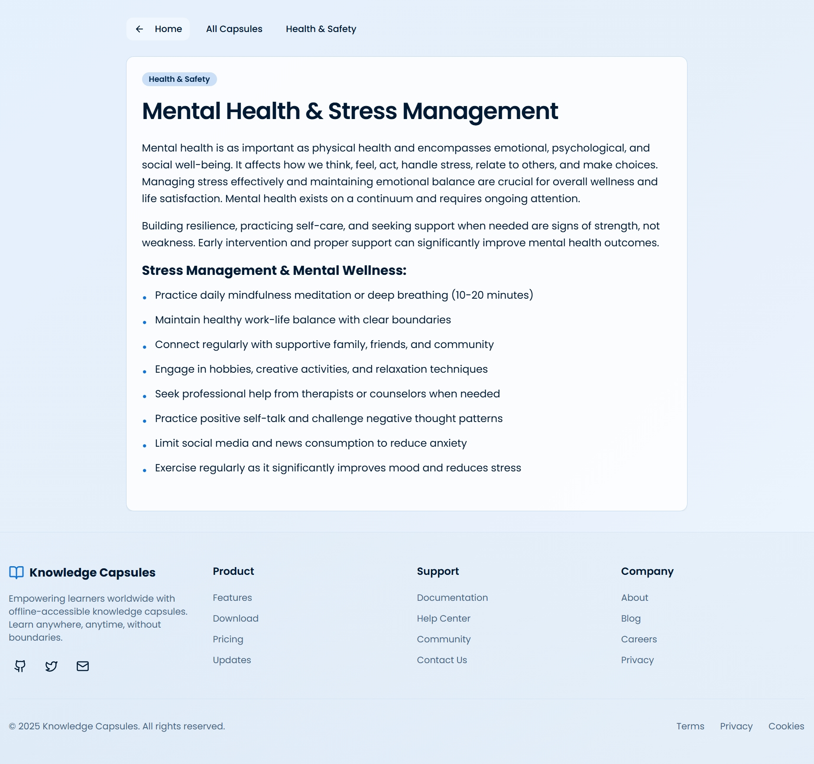

###  Fun and Creativity Page
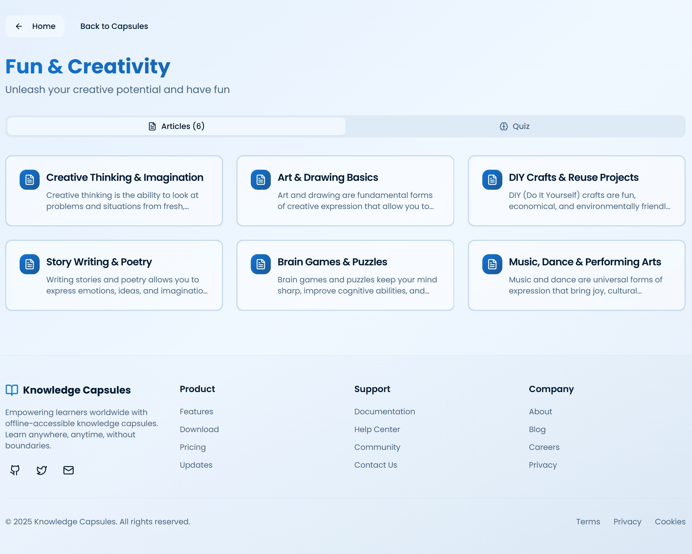

###   Quiz...
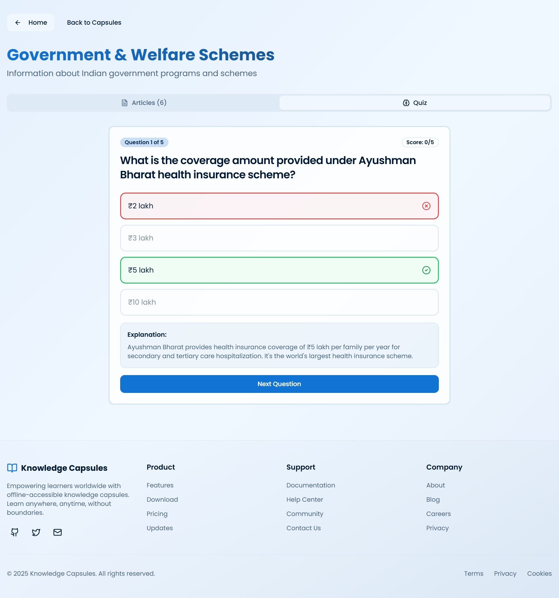

###  Results of  Quiz...
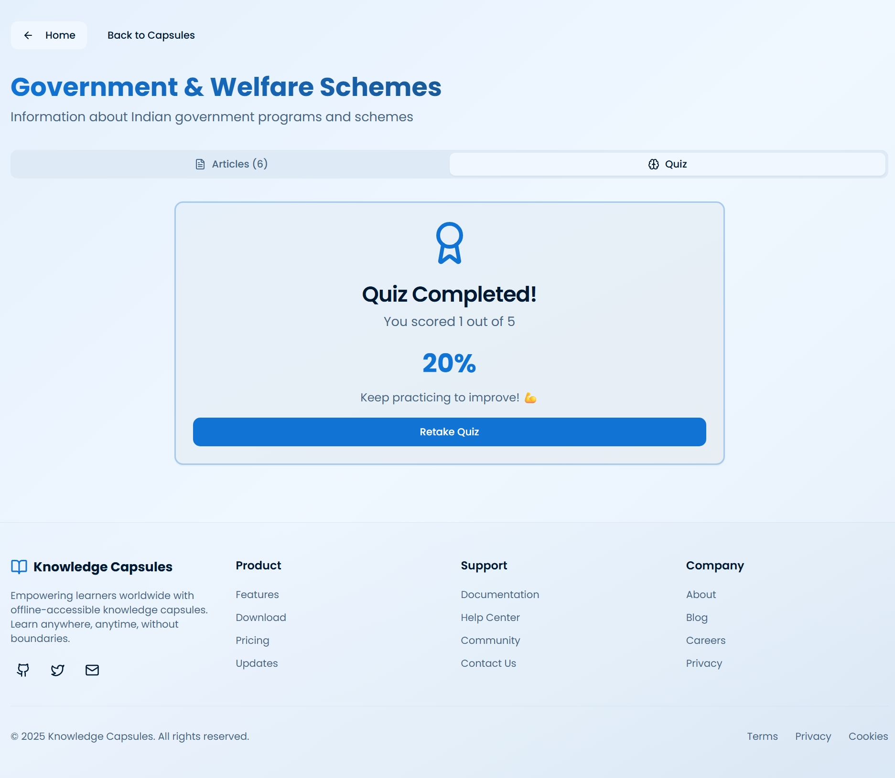

---

## 🚀 Installation & Setup

    git clone https://github.com/rdeekshitha184-ship-it/OFFLINE-KNOWLEDE-CAPSULE-.git
    cd OFFLINE-KNOWLEDE-CAPSULE-
    npm install
    npm run dev

---

## 📌 Future Enhancements

- 🔍 Search functionality  
- 🧠 AI-based recommendations  
- 📱 Full PWA install support  
- 🌍 Multi-language support  

---

## 👩‍💻 Author

**R Deekshitha**

---

## ⭐ Support

If you like this project, give it a ⭐ on GitHub!